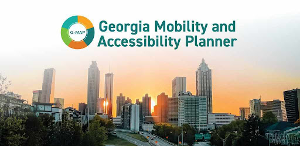

# GMap - OpenTripPlanner iOS Application



G-Map - Your journey, your path - Mobility thru greater accessibility
The Georgia Mobility and Access Planner, or G-MAP, developed through a collaboration between the Georgia Department of Transportation, Atlanta Regional Commission, and Gwinnett County, will make sure you have access to transportation that allows you to live as independently as possible. 

G-MAP’s goal is to help all travelers, especially people with disabilities, older adults, and travelers with limited English proficiency, get to the grocery store, appointments, or anywhere you need to go in Gwinnett County safely and efficiently. 

Travelers will be able to use G-MAP on the website or the mobile app to create a personalized trip plan based on their needs and preferences. G-MAP will be able to improve your transportation experience and is capable of being used to help navigate physical infrastructure, avoid unexpected obstacles and help ensure your location visibility throughout your travels.

This is a comprehensive iOS transit planning application built with SwiftUI and OpenTripPlanner (OTP) integration. GMap provides real-time transit information, trip planning, route tracking, and indoor navigation capabilities.

## Table of Contents

- [Features](#features)
- [Requirements](#requirements)
- [Installation](#installation)
- [Configuration](#configuration)
- [Quick Start](#quick-start)
- [Architecture](#architecture)
- [Security](#security)
- [Dependencies](#dependencies)
- [Building the Project](#building-the-project)
- [Customization](#customization)
- [Contributing](#contributing)
- [License](#license)

## Features

- **Trip Planning**: Multi-modal trip planning with real-time transit data
- **Live Route Tracking**: Real-time vehicle tracking and arrival predictions
- **Indoor Navigation**: Jibestream-powered indoor wayfinding
- **Accessibility**: Full VoiceOver support and accessibility features
- **Multi-language Support**: English, Spanish, Korean, Vietnamese, Chinese, Russian, and Tagalog
- **User Profiles**: Save favorite locations, trips, and preferences
- **Push Notifications**: Real-time alerts for saved trips
- **Mapbox Integration**: Interactive maps with custom styling
- **Auth0 Authentication**: Secure user authentication and authorization

## Requirements

### System Requirements

- **macOS**: 12.0 (Monterey) or later
- **Xcode**: 14.0 or later
- **iOS Deployment Target**: 17.6 or later
- **Swift**: 5.0 or later
- **CocoaPods**: 1.11.0 or later

### Hardware Requirements

- Mac with Apple Silicon (M1/M2/M3) or Intel processor
- Minimum 8GB RAM (16GB recommended)
- 10GB free disk space

## Installation

### 1. Clone the Repository

```bash
git clone https://github.com/gmapdev/g-map-ios.git
cd g-map-ios
```

### 2. Install CocoaPods

If you don't have CocoaPods installed:

```bash
sudo gem install cocoapods
```

### 3. Install Dependencies

```bash
pod install
```

This will install the following dependencies:
- Mapbox-iOS-SDK (~> 6.3.0)
- Lock (~> 2.0) - Auth0 authentication
- JMapiOSSDK - Jibestream indoor mapping
- NavigationKit-iOS-Pod - Indoor navigation
- On-Device-Positioning-Pod - Indoor positioning

### 4. Open the Workspace

**IMPORTANT**: Always open the `.xcworkspace` file, not the `.xcodeproj` file:

```bash
open ATLRides.xcworkspace
```

## Configuration

### Server Configuration (config.json)

The application loads its configuration from an **encrypted** `config.json` file. This file contains critical settings including:

- OpenTripPlanner server endpoints
- GraphQL API URLs
- Mapbox access tokens (This one needs to be configed in Info.plist - MGLMapboxAccessToken)
- Auth0 credentials
- Feature flags
- Branding settings

#### Configuration Loading Process

1. **Encrypted Configuration**: The app loads `config.json` from an encrypted file on first launch (you can generate your own encypted configuration file by using the generate\_encrypted\_config.py). After you update your configuration json data for the config.json. you can type the command below, to get your encrypted config.json file.  

```
python3 generate_encrypted_config.py
```
2. **Server-Side Hosting**: You should host this encrypted configuration file on your own server. if not, you will use the default config.json configuration.
3. **Dynamic Updates**: The app can fetch updated configurations from your server endpoint

#### Setting Up Your Configuration

**IMPORTANT SECURITY NOTICE**: Before deploying to production, you **MUST** update the encryption keys in `IBISecurity.swift`:

```swift
// File: Shared/Services/IBIServices/IBISecurity.swift

public class IBISecurity {
    // ⚠️ CHANGE THESE VALUES FOR YOUR DEPLOYMENT ⚠️
    let key = "YOUR_32_BYTE_HEX_KEY_HERE"  // 64 hex characters (32 bytes)
    let iv = "YOUR_16_BYTE_HEX_IV_HERE"    // 32 hex characters (16 bytes)
}
```

**Steps to secure your configuration:**

1. Generate new AES-256 encryption key and IV:
   ```bash
   # Generate 32-byte key (256-bit)
   openssl rand -hex 32

   # Generate 16-byte IV (128-bit)
   openssl rand -hex 16
   ```

2. Update the `key` and `iv` values in `IBISecurity.swift`

3. Encrypt your `config.json` using the new key and IV

4. Host the encrypted file on your secure server

5. Update the configuration endpoint in your app

**Why this is critical**: The default keys in the repository are public and should **NEVER** be used in production. Using custom keys ensures your configuration data remains secure.

### Configuration File Structure

The `config.json` file should contain:

```json
{
    "appVersion": 1,
    "brandInfo": {
      "[map_style]": [
        "satellite",
        "streets"
      ],
      "account_api_key": "your-own-information",
      "android_vibration_duration_ms": 250,
      "android_vibration_intensity": 70,
      "app_api_key": "your-own-information",
      "app_identifier": "gmap",
      "auth0_client_id": "your-own-information",
      "auth0_client_secret": "your-own-information",
      "auth0_domain": "https://arc-otp.us.auth0.com",
      "autocomplete_url": {
        "production": "https://ao9yvlrax5.execute-api.us-east-1.amazonaws.com/atl",
        "staging": "https://ao9yvlrax5.execute-api.us-east-1.amazonaws.com/atl"
      },
      "base_url": {
        "production": "https://zcl3o5i5ib.execute-api.us-east-1.amazonaws.com/prod",
        "staging": "https://zcl3o5i5ib.execute-api.us-east-1.amazonaws.com/prod"
      },
      "boundary": "32.066,-86.0856;35.7251,-81.9499",
      "enable_background_location_update": true,
      "enable_route_filter": false,
      "environment": "production",
      "graphql_base_url": {
        "production": "https://zcl3o5i5ib.execute-api.us-east-1.amazonaws.com/prod/otp/gtfs/v1",
        "staging": "https://zcl3o5i5ib.execute-api.us-east-1.amazonaws.com/prod/otp/gtfs/v1"
      },
      "ios_haptic_feedback_type": "sucess",
      "latitude_of_map_center": 33.956695,
      "live_tracking_deviation_waittime_seconds": 30,
      "logging_url": {
        "production": "https://logging.ibigroupmobile.com",
        "staging": "https://logging-test.ibigroupmobile.com"
      },
      "longitude_of_map_center": -83.98901,
      "map_style": "streets",
      "max_number_of_saved_trips": 5,
      "navigation_bar_height": 50,
      "realtime_businfo_refresh_interval": 30,
      "request_api_key": "your-own-information",
      "service_url": {
        "production": "https://st-push-middleware-test.ibi-transit.com/ext_api/otp_push",
        "staging": "https://st-push-middleware-test.ibi-transit.com/ext_api/otp_push"
      },
      "timezone": "America/Toronto",
      "zoom_level": 12
    },
    "feature": {
      "Indoor Navigation": {
        "detail": {
          "currentLocation_upcoming_point_threshold_feet": 10,
          "current_instruction_should_update_in_seconds": 2,
          "current_location_should_update_in_seconds": 1,
          "extends_sdk_key_android": "your-own-information",
          "extends_sdk_key_ios": "your-own-information",
          "extends_sdk_url": "https://v2.tendegrees.net",
          "indoor_checking_active_route_entrance": true,
          "indoor_entrance_exit_checking_interval_secs": 5,
          "indoor_entrance_exit_list_url": "https://ta-511.s3.us-east-1.amazonaws.com/otp/indoor_entrance_exit_list.json",
          "indoor_entrance_exit_popup_distance_mm": 3048,
          "indoor_main_entrance_list": "https://ta-511.s3.us-east-1.amazonaws.com/gmap/indoor_main_entrance_popup.json",
          "indoor_nav_deviation_distance_mm": 5000,
          "indoor_nav_deviation_popup_count_max_number": 3,
          "indoor_nav_deviation_popup_wait_time_accumulate": false,
          "indoor_nav_deviation_popup_wait_time_seconds": 30,
          "indoor_triggerable_locations": "https://ta-511.s3.amazonaws.com/gmap/jmap_triggerable_locations.json",
          "indoor_ui_should_display_distance": false,
          "is_enabled": true,
          "jibesream_customer_id": 460,
          "jibestream_client_id": "b1e335b1-8f05-49a7-89de-8efb23da6793",
          "jibestream_client_secret": "your-own-information",
          "jibestream_endpoint_url": "https://api.jibestream.com",
          "main_entrance_detection_radius_meters": 10,
          "snap_to_wayfind_path_threshold_in_meter": 8
        },
        "note": "CXApp SDK integration for Indoor Navigation",
        "release": "2024-11-04"
      },
      "Live Tracking": {
        "detail": {
          "is_enabled": true,
          "live_tracking_deviation_waittime_seconds": 30,
          "live_tracking_repeat_instruction_waittime_seconds": 30
        },
        "note": "Live Tracking for already saved trips",
        "release": "2025-06-10"
      },
      "Login": {
        "detail": {
          "available_notification_methods": "Email,SMS,PushNotification,HapticFeedback",
          "enable_mobile_questionairs": true,
          "help_url": "https://georgia-map.com/",
          "is_enabled": true,
          "logo_height": 90,
          "logo_width": 90,
          "title": "",
          "url_terms_of_service": "https://ta-511.s3.amazonaws.com/otp/g-map_terms_of_use.html",
          "url_terms_of_storage": "https://gmap.ibi-transit.com/#/terms-of-storage"
        },
        "note": "Manage Login Page",
        "release": "2023-08-16"
      },
      "Menu": {
        "detail": {
          "is_enabled": true,
          "items": {
            "FAQ": {
              "icon": "ic_external_link",
              "isVisible": true,
              "order": 3,
              "title": "FAQ",
              "type": "link",
              "url": "https://docs.google.com/document/d/1lax8Blu3vgrdKcHYrZyjhkSR24rcaefintQBj9d99bM/edit?tab=t.0#heading=h.excjk1gx0erl"
            },
            "Feedback": {
              "icon": "ic_leavefeedbacks",
              "isVisible": true,
              "order": 1,
              "title": "Leave Feedback",
              "type": "link",
              "url": "https://arc-survey.vercel.app/"
            },
            "Help": {
              "icon": "ic_external_link",
              "isVisible": true,
              "order": 7,
              "title": "Help",
              "type": "link",
              "url": "https://georgia-map.com/"
            },
            "Stations": {
              "icon": "ic_stations",
              "isVisible": false,
              "order": 6,
              "title": "Stations",
              "type": "link",
              "url": "https://www.soundtransit.org/ride-with-us/stations"
            }
          }
        },
        "note": "Manage App Side Menu",
        "release": "2023-08-16"
      },
      "Modes": {
        "detail": {
          "agencies_logo_base_url": "https://ta-511.s3.amazonaws.com/otp/agencies_logos/",
          "all_mode_list": "https://ta-511.s3.amazonaws.com/otp/gmap_mode_list.json",
          "is_enabled": true,
          "priorities_route_agency_order": true,
          "route_mode_agencies_mapping": "Gwinnett County Transit,Ride Gwinnett;Metropolitan Atlanta Rapid Transit Authority,MARTA;",
          "route_mode_combinations_url": "https://atlrides.com/mode-combinations.json",
          "route_mode_name_mapping": "rail,MARTA Rail;tram,Atlanta Streetcar",
          "route_mode_overrides": "",
          "sorted_route_order_url": "https://ta-511.s3.us-east-1.amazonaws.com/otp/route_sorted_order.json"
        },
        "note": "Used to manage the mode combination",
        "release": "2023-08-16"
      },
      "Search": {
        "detail": {
          "[request_type]": [
            "RESTful API",
            "GraphQL API"
          ],
          "available_criterias": {
            "maximum_walk": "1/10,1/4,1/2,3/4,1,2,5",
            "optimize": "Speed,Fewest Transfers",
            "walk_speed": "1:0.45,2:0.89,3:1.34,4:1.78,5:2.23"
          },
          "default_criterias": {
            "accessible_routing": false,
            "allow_bike_rental": true,
            "avoid_walking": false,
            "maximum_walk": "3/4",
            "optimize": "Speed",
            "walk_speed": 3
          },
          "enable_report_tracking_gps": true,
          "enable_start_route": true,
          "is_enabled": true,
          "request_type": "GraphQL API",
          "search_error_list_mapping": "https://ta-511.s3.amazonaws.com/otp/error_mapping_list.json",
          "selectable_modes": "TRANSIT:BUS,SUBWAY,STREETCAR;BICYCLE;CAR"
        },
        "note": "Provide the Configuration for the search mode candidates.",
        "release": "2023-08-16"
      }
    },
    "revision": 87,
    "theme": {
      "Dark_Mode_Skin": "Dark",
      "Light_Mode_Skin": "Light",
      "Template": {
        "Dark": {
          "color": {
            "cameradetail_title_brandinfo_color": "#ffffff",
            "foreground_color": "#ffffff",
            "mask_background_color": "#cccccc",
            "menu_logo_color": "#eeeeee",
            "plan_trip_button_in_search_bg_color": "#008000",
            "plan_trip_button_in_search_font_color": "#FFFFFF",
            "primary_background_color": "#333533",
            "primary_color": "#606c38",
            "secondary_background_color": "#999999",
            "secondary_color": "#cccccc",
            "tertiary_color": "#ffffff",
            "toggle_off_color": "#999999",
            "toggle_on_color": "#606c38"
          },
          "font": {
            "body_font_size": 16,
            "footnote_font_size": 12,
            "primary_font_family": "Helvetica",
            "secondary_font_family": "Helvetica Neue",
            "title_font_size": 28
          }
        },
        "Light": {
          "color": {
            "cameradetail_title_brandinfo_color": "#ff0000",
            "foreground_color": "#000000",
            "mask_background_color": "#000000",
            "menu_logo_color": "#aaaaaa",
            "plan_trip_button_in_search_bg_color": "#008000",
            "plan_trip_button_in_search_font_color": "#FFFFFF",
            "primary_background_color": "#ffffff",
            "primary_color": "#b2d235",
            "secondary_background_color": "#979797",
            "secondary_color": "#056C78",
            "tertiary_color": "#3f4b50",
            "toggle_off_color": "#999999",
            "toggle_on_color": "#979797"
          },
          "font": {
            "body_font_size": 17,
            "footnote_font_size": 12,
            "primary_font_family": "Helvetica",
            "secondary_font_family": "Helvetica Neue",
            "title_font_size": 28
          }
        }
      }
    }
}
```

## Quick Start

### 1. Configure Your Environment

Before running the app, ensure you have:

- Valid OpenTripPlanner server URL
- Mapbox access token ([Get one here](https://account.mapbox.com/))
- Auth0 account and credentials ([Sign up here](https://auth0.com/))
- Updated encryption keys in `IBISecurity.swift`

### 2. Build and Run

1. Open `ATLRides.xcworkspace` in Xcode
2. Select the `GMap` scheme
3. Choose your target device or simulator (iOS 17.6+)
4. Press `Cmd + R` to build and run

### 3. First Launch

On first launch, the app will:
1. Request location permissions
2. Load the encrypted configuration file
3. Initialize the OpenTripPlanner connection
4. Display the main map view

## Architecture

### Project Structure

```
otp-ios-swiftui/
├── GMap/                          # Main app target
│   ├── Info.plist
│   └── ITS_Assets.xcassets
├── Shared/                        # Shared code between targets
│   ├── Configuration/             # App configuration and setup
│   │   ├── AppConfig.swift       # Configuration management
│   │   ├── BrandConfig.swift     # Branding customization
│   │   ├── FeatureConfig.swift   # Feature flags
│   │   └── ThemeConfig.swift     # Theme and styling
│   ├── Services/                  # Business logic and API
│   │   ├── Managers/             # State management
│   │   ├── Providers/            # API providers
│   │   └── Models/               # Data models
│   ├── Views/                     # SwiftUI views
│   │   ├── Home/                 # Map and home screen
│   │   ├── TripPlanning/         # Trip planning UI
│   │   ├── ProfileViewer/        # User profile
│   │   └── RouteViewer/          # Route details
│   ├── Utils/                     # Utility classes
│   │   ├── OTPLog.swift          # Centralized logging
│   │   └── Helper.swift          # Helper functions
│   └── Extensions/                # Swift extensions
└── Pods/                          # CocoaPods dependencies
```

### Key Components

#### 1. Configuration System

The app uses a three-tier configuration system:

- **BrandConfig**: Manages branding, colors, logos, and app identity
- **FeatureConfig**: Controls feature flags and capabilities
- **ThemeConfig**: Handles UI themes and styling

**Example: Customizing Branding**

```swift
// File: Shared/Configuration/BrandConfig.swift

// Update these values to customize your app
BrandConfig.shared.app_name = "Your Transit App"
BrandConfig.shared.primary_color = "#007AFF"
BrandConfig.shared.default_location = CLLocationCoordinate2D(
    latitude: 33.7490,
    longitude: -84.3880
)
```

#### 2. Service Architecture

- **Managers**: Handle state and business logic (MapManager, TripPlanningManager, etc.)
- **Providers**: Interface with external APIs (TripProvider, UserAccountProvider, etc.)
- **Models**: Data structures for API responses and app state

#### 3. Logging System

The app uses a centralized logging system (`OTPLog`) for debugging and monitoring:

```swift
// Enable console logging (development)
OTPLog.enableConsoleLogging()

// Disable console logging (production)
OTPLog.disableConsoleLogging()

// Log messages
OTPLog.log(level: .info, info: "Trip planning started")
OTPLog.log(level: .error, info: "API request failed")
```

## Security

### Encryption

The app uses AES-256 encryption for sensitive data:

- Configuration files are encrypted using `IBISecurity` class
- User credentials are stored in iOS Keychain
- API tokens are encrypted in transit

### Best Practices

1. **Never commit sensitive data** to version control
2. **Update encryption keys** before production deployment
3. **Use environment variables** for API keys during development
4. **Enable App Transport Security** (ATS) for all network requests
5. **Implement certificate pinning** for production APIs

## Dependencies

### Core Dependencies

| Library | Version | Purpose |
|---------|---------|---------|
| Mapbox-iOS-SDK | ~> 6.3.0 | Interactive maps and navigation |
| Lock | ~> 2.0 | Auth0 authentication UI |
| JMapiOSSDK | Latest | Jibestream indoor mapping |
| NavigationKit-iOS-Pod | Latest | Indoor navigation |
| On-Device-Positioning-Pod | Latest | Indoor positioning |

### Dependency Management

All dependencies are managed via CocoaPods. To update dependencies:

```bash
pod update
```

To add a new dependency, edit the `Podfile` and run:

```bash
pod install
```

## Building the Project

### Development Build

```bash
# Clean build folder
xcodebuild clean -workspace ATLRides.xcworkspace -scheme GMap

# Build for simulator
xcodebuild -workspace ATLRides.xcworkspace \
           -scheme GMap \
           -sdk iphonesimulator \
           -destination 'platform=iOS Simulator,name=iPhone 15' \
           build
```

### Release Build

```bash
# Archive for distribution
xcodebuild -workspace ATLRides.xcworkspace \
           -scheme GMap \
           -sdk iphoneos \
           -configuration Release \
           -archivePath ./build/GMap.xcarchive \
           archive
```

### Common Build Issues

#### Issue: "Unable to find module dependency: 'Auth0'"

**Solution**: Make sure you opened the `.xcworkspace` file, not `.xcodeproj`:
```bash
open ATLRides.xcworkspace
```

#### Issue: CocoaPods dependencies not found

**Solution**: Reinstall pods:
```bash
pod deintegrate
pod install
```

#### Issue: Bitcode errors with Mapbox

**Solution**: The `Podfile` includes post-install scripts to strip bitcode. Ensure they run successfully.

## Customization

### Branding Your App

The app is designed to be easily customizable for different transit agencies:

#### 1. Update BrandConfig

```swift
// File: Shared/Configuration/BrandConfig.swift

public class BrandConfig {
    // App Identity
    var app_name = "Your Transit App"
    var agency_name = "Your Transit Agency"

    // Colors
    var primary_color = "#007AFF"
    var secondary_color = "#5856D6"

    // Map Settings
    var default_location = CLLocationCoordinate2D(
        latitude: 33.7490,
        longitude: -84.3880
    )
    var zoom_level = 12.0

    // API Endpoints
    var otp_base_url = "https://your-otp-server.com"
    var graphQL_base_url = "https://your-api.com/graphql"
}
```

#### 2. Update FeatureConfig

Enable or disable features based on your needs:

```swift
// File: Shared/Configuration/FeatureConfig.swift

public class FeatureConfig {
    // Feature Flags
    var enable_live_tracking = true
    var enable_indoor_navigation = false
    var enable_bike_share = true
    var enable_scooter_share = true
    var enable_park_and_ride = true
    var enable_push_notifications = true

    // Trip Planning Options
    var available_modes = ["TRANSIT", "WALK", "BICYCLE", "CAR"]
    var max_walk_distance = 1000.0  // meters
    var max_bike_distance = 5000.0  // meters
}
```

#### 3. Update ThemeConfig

Customize the visual appearance:

```swift
// File: Shared/Configuration/ThemeConfig.swift

public class ThemeConfig {
    // Typography
    var font_family = "System"
    var heading_size = 24.0
    var body_size = 16.0

    // Spacing
    var padding_small = 8.0
    var padding_medium = 16.0
    var padding_large = 24.0

    // Border Radius
    var corner_radius = 12.0
}
```

#### 4. Replace Assets

Update the following assets in `Shared/Resources/SharedAssets.xcassets`:

- App icon
- Launch screen
- Agency logos
- Mode icons
- Map markers

### Adding Custom Features

To add a new feature:

1. Add feature flag to `FeatureConfig.swift`
2. Create new views in `Shared/Views/`
3. Add business logic to `Shared/Services/Managers/`
4. Update navigation in `TabBarMenuManager.swift`

## Contributing

We welcome contributions! Please follow these guidelines:

### Getting Started

1. Fork the repository
2. Create a feature branch: `git checkout -b feature/your-feature-name`
3. Make your changes
4. Write or update tests
5. Commit your changes: `git commit -m 'Add some feature'`
6. Push to the branch: `git push origin feature/your-feature-name`
7. Submit a pull request

### Code Style

- Follow Swift API Design Guidelines
- Use SwiftLint for code formatting
- Add documentation comments for public APIs
- Write descriptive commit messages

### Testing

- Write unit tests for new features
- Ensure all tests pass before submitting PR
- Test on both simulator and physical devices
- Test with VoiceOver enabled for accessibility

## Troubleshooting

### Location Services Not Working

1. Check Info.plist for location usage descriptions
2. Verify location permissions in Settings
3. Ensure `locationManagerDidChangeAuthorization` is implemented

### Map Not Loading

1. Verify Mapbox access token is valid
2. Check network connectivity
3. Review console logs for API errors

### Configuration Not Loading

1. Verify encryption keys match between app and server
2. Check server endpoint is accessible
3. Validate JSON structure of config file

### Build Errors

1. Clean build folder: `Cmd + Shift + K`
2. Delete derived data: `rm -rf ~/Library/Developer/Xcode/DerivedData`
3. Reinstall pods: `pod deintegrate && pod install`


## Support

For questions, issues, or feature requests:

- Open an issue on GitHub
- Contact: _Global-digitalintelligence-mobile@arcadis.com

## License

This project is licensed under the MIT License - see the [LICENSE](LICENSE) file for details.

## Acknowledgments

- OpenTripPlanner community
- Mapbox for mapping services
- Auth0 for authentication
- Jibestream for indoor navigation
- All contributors and maintainers

---

1